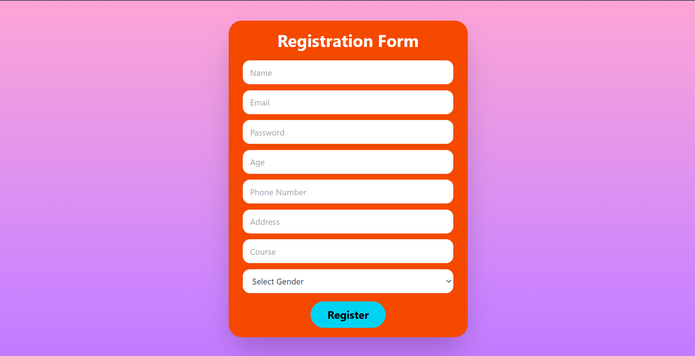

# Registration Form

A full-stack registration form application built with React, Node.js, Express.js, and MongoDB. Users can submit their personal and course information through a responsive registration form, and the data is securely stored in MongoDB.

## 🚀 Live Demo

Frontend: https://registration-form-1-o9go.onrender.com/

Backend API: https://registration-form-s704.onrender.com/

## 📸 Project Preview



## 📌 Features

- Responsive registration form
- User name and email input
- Password input with secure hashing
- Age, phone number, and address fields
- Course selection/input
- Gender selection
- Form validation
- REST API integration
- MongoDB database integration
- Duplicate email detection
- Secure password hashing using bcrypt
- CORS configuration
- Responsive UI for desktop and mobile
- Deployed frontend and backend

## 🛠️ Technologies Used

### Frontend

- React.js
- Vite
- Tailwind CSS
- Axios
- JavaScript
- HTML5
- CSS3

### Backend

- Node.js
- Express.js
- MongoDB
- Mongoose
- bcryptjs
- CORS
- dotenv

### Deployment & Tools

- Git
- GitHub
- Render
- MongoDB Atlas
- VS Code

## 📂 Project Structure

```text
Registration-Form/
│
├── client/
│   ├── src/
│   │   ├── Component/
│   │   │   └── Signup.jsx
│   │   ├── App.jsx
│   │   ├── App.css
│   │   ├── index.css
│   │   └── main.jsx
│   ├── package.json
│   └── vite.config.js
│
├── server/
│   ├── models/
│   │   └── User.js
│   ├── package.json
│   └── server.js
│
├── .gitignore
└── README.md